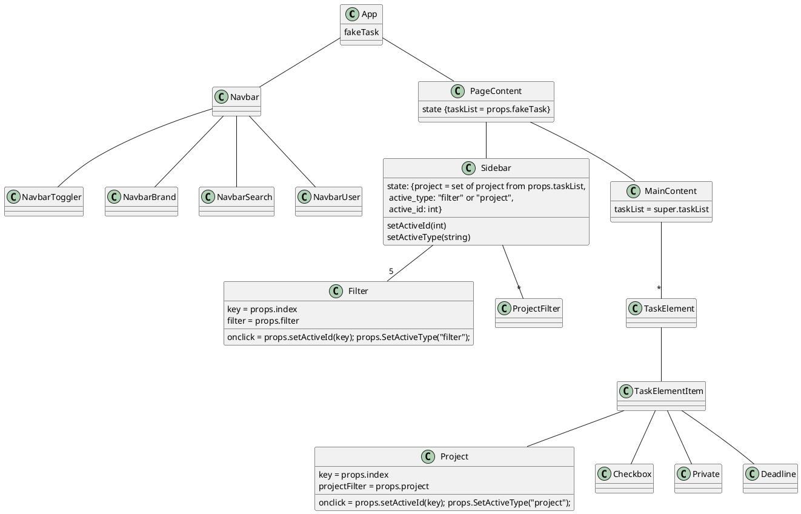

# Structure of react application

```plantuml
@startuml
class App{
    fakeTask
}
class Navbar
class PageContent{
    state {taskList = props.fakeTask}
}
class NavbarToggler
class NavbarBrand
class NavbarSearch
class NavbarUser
class Sidebar{
    state: {project = set of project from props.taskList,\n active_type: "filter" or "project",\n active_id: int}
    setActiveId(int)
    setActiveType(string)
    
}
class Filter{
    key = props.index
    filter = props.filter
    onclick = props.setActiveId(key); props.SetActiveType("filter");
}
class Project{
    key = props.index
    projectFilter = props.project
    onclick = props.setActiveId(key); props.SetActiveType("project");
}
class MainContent{
    taskList = super.taskList
}
class TaskElement
class TaskElementItem
class Checkbox
class Private
class Deadline
class Filter
class ProjectFilter


App -- Navbar
App -- PageContent
Navbar -- NavbarToggler
Navbar -- NavbarBrand
Navbar -- NavbarSearch
Navbar -- NavbarUser
PageContent -- Sidebar
PageContent -- MainContent
MainContent --"*" TaskElement
TaskElement -- TaskElementItem
TaskElementItem -- Checkbox
TaskElementItem -- Private
TaskElementItem -- Deadline
TaskElementItem -- Project
Sidebar --"5" Filter
Sidebar --"*" ProjectFilter
@enduml
```